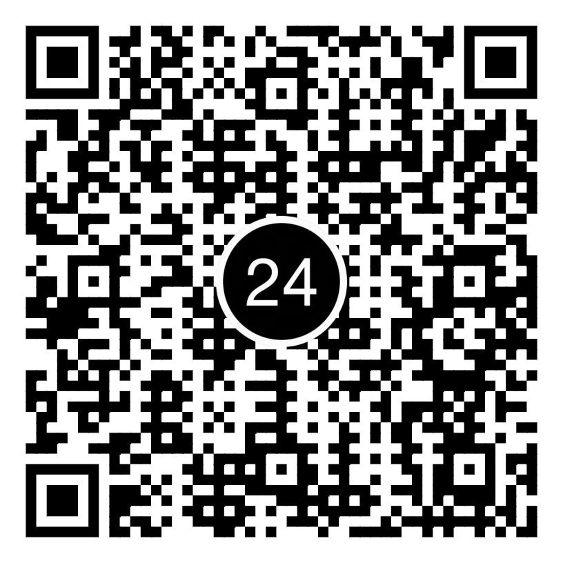
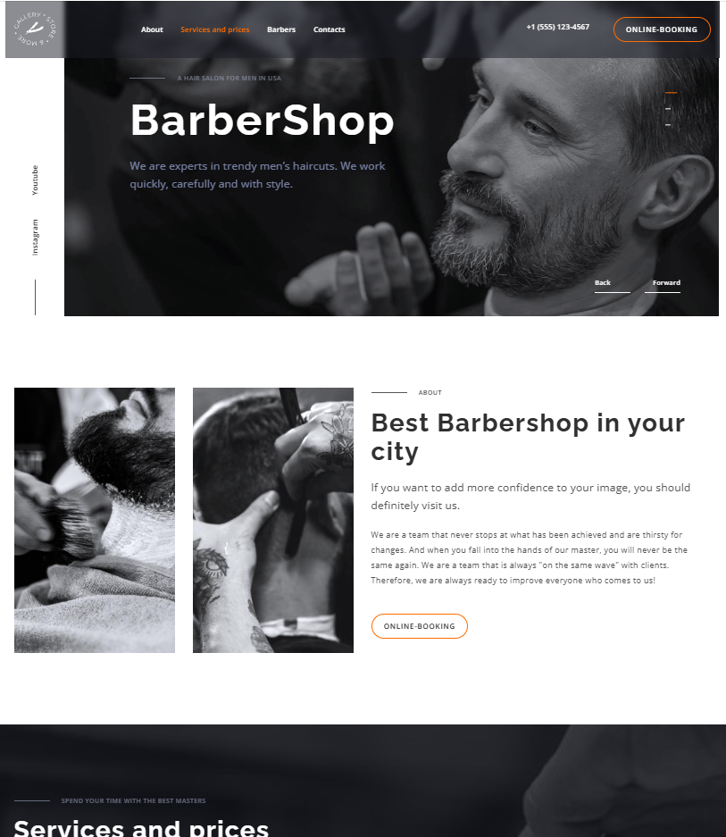

# Barbershop
 Adaptive website.
 Made with HTML, SCSS & JavaScript. 
 Design from figma: https://www.figma.com/design/qV1qVBeSJlrD5lbvrgcc0N/Barbershop-EN?node-id=0-1&p=f&t=fKoGx69D9JaPwJue-0

## ❤️ If my projects are helpful, you can support me

Your support helps me continue developing and improving open-source projects.  
Any amount is greatly appreciated 🙏

---

### 📱 Scan to support via Privat24

Thank you for using and supporting my projects! 🚀

---

### Design layout

